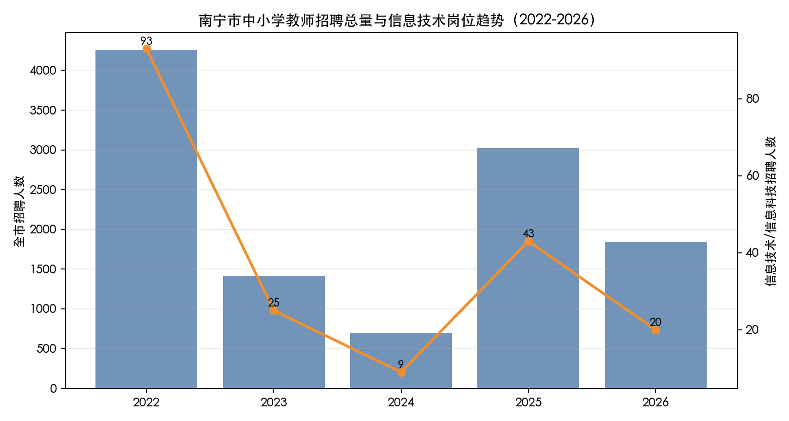
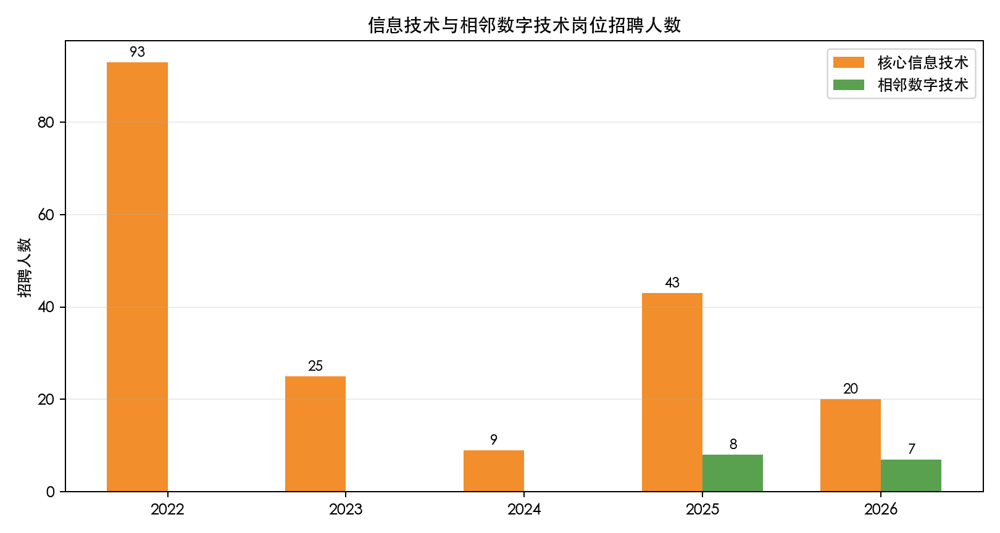
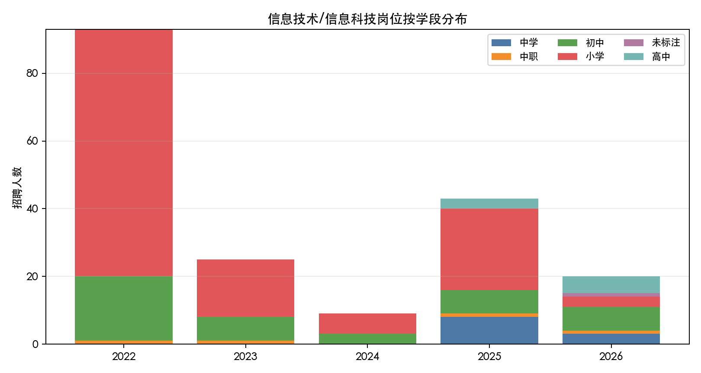
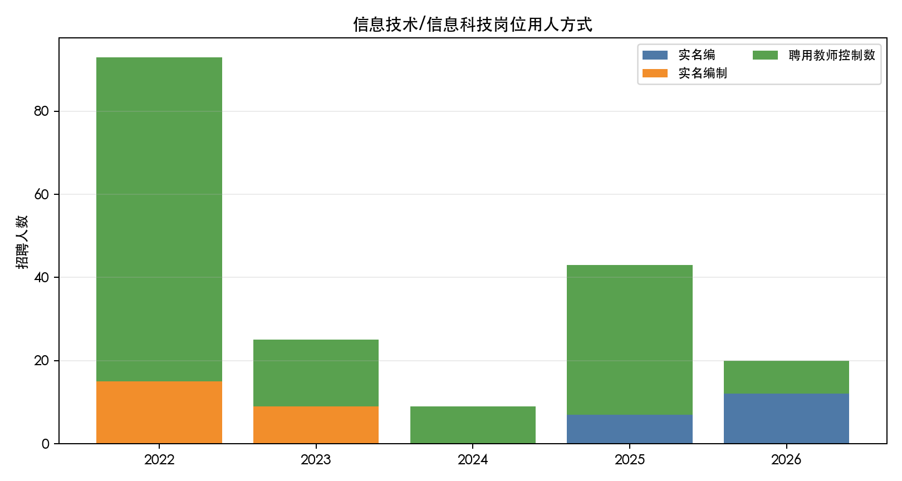
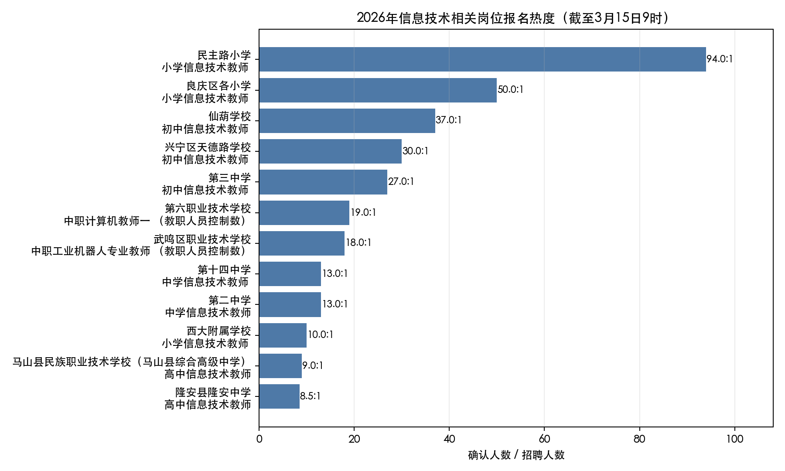

# 南宁市公开招聘中小学信息技术教师考试趋势分析报告

研究日期：2026-05-28  
研究对象：南宁市公开考试招聘中小学教师中的“信息技术/信息科技”教师岗位；另单列中职计算机、网络、工业机器人、智能制造、数字媒体等相邻数字技术岗位。  
数据窗口：岗位级主分析为 2022-2026 年；2021 年因官方岗位附件失效，仅作为制度背景使用。

---

## 一、摘要

2022-2026 年，南宁市公开招聘中小学教师总量经历了“2022 高峰、2024 低谷、2025 回弹、2026 再收缩”的波动；但信息技术教师岗位没有同步回到 2022 年的高位。核心信息技术/信息科技招聘人数从 2022 年 93 人降至 2026 年 20 人，占全市招聘人数比例从 2.18% 降至 1.08%。这说明信息技术岗位的收缩不仅是总招聘盘子缩小造成的，也带有学科岗位配置相对下降的特征。

考试制度方面，南宁教师招聘在 2025 年出现明显拐点。2022-2024 年沿用事业单位分类考试公共科目 D 类，两科为《职业能力倾向测验》和《综合应用能力》，但 2023、2024 年公告明确笔试不计入考试总成绩，面试成绩即总成绩。2025-2026 年改为岗位化考试：笔试一科、满分 100 分，测试职业道德及岗位所需专业知识技能；参加笔试岗位总成绩为笔试 50% + 面试 50%。2026 年还增加了笔试合格分数线约束，笔试未达线不得入围面试。

对考生而言，备考策略必须从“D 类公共科目过门槛 + 面试决胜”转向“专业笔试和专业能力测试双线并重”。同时，城区名校信息技术岗位竞争极高，2026 年官方报名动态显示，截至 2026 年 3 月 15 日 9 时，南宁市民主路小学小学信息技术教师已达 94:1，良庆区各小学小学信息技术教师达 50:1。

---

## 二、数据来源与处理方法

### 2.1 公开来源

本报告使用的公开资料包括：

- 南宁市教育局/南宁市人社局公开招聘简章、岗位表与报名动态附件。
- 华图、航帆网、环球网校等转载页，主要用于校验历史公告和下载已不便直接访问的附件。
- 教育部《义务教育课程方案和课程标准（2022年版）》及《义务教育信息科技课程标准（2022年版）》，用于解释“信息技术”向“信息科技”和数字素养方向迁移的政策背景。

主要网页来源见文末“资料来源”。

### 2.2 数据处理口径

本次清洗生成了 3 个核心数据表：

- `data/nanning_teacher_positions_2022_2026.csv`：2022-2026 年岗位表标准化后全量岗位，共 7286 条岗位记录。
- `data/nanning_it_related_positions_2022_2026.csv`：信息技术/信息科技及相邻数字技术岗位，共 191 条岗位记录。
- `data/nanning_2026_it_registration_0315.csv`：2026 年 3 月 15 日 9 时官方报名动态中信息技术相关岗位报名热度。

岗位分类口径如下：

- 核心信息技术/信息科技岗位：岗位名称或学科字段包含“信息技术”“信息科技”。
- 相邻数字技术岗位：岗位名称包含“计算机”“网络”“数字媒体”“工业机器人”“智能制造”等，主要集中在中职岗位。该分类为研究口径，不是官方字段。

---

## 三、年度招聘趋势

### 3.1 全市招聘总量与信息技术岗位同步性减弱

| 年份 | 全市岗位数 | 全市招聘人数 | 核心信息技术岗位数 | 核心信息技术招聘人数 | 信息技术人数占比 |
|---|---:|---:|---:|---:|---:|
| 2022 | 2736 | 4263 | 89 | 93 | 2.18% |
| 2023 | 921 | 1414 | 24 | 25 | 1.77% |
| 2024 | 506 | 698 | 8 | 9 | 1.29% |
| 2025 | 1924 | 3025 | 39 | 43 | 1.42% |
| 2026 | 1199 | 1845 | 19 | 20 | 1.08% |

图 1 显示，2025 年全市教师招聘总人数从 2024 年的 698 人回升到 3025 人，但核心信息技术教师仅从 9 人回升到 43 人，仍低于 2022 年的 93 人。到 2026 年，全市招聘人数下降至 1845 人，核心信息技术岗位同步降至 20 人。  

**判断：** 信息技术教师岗位整体处于“从 2022 年高位回落后，低位波动”的阶段，不能简单用总招聘规模解释其收缩。

### 3.2 相邻数字技术岗位从 2025 年开始出现

| 年份 | 相邻数字技术岗位数 | 相邻数字技术招聘人数 |
|---|---:|---:|
| 2022 | 0 | 0 |
| 2023 | 0 | 0 |
| 2024 | 0 | 0 |
| 2025 | 6 | 8 |
| 2026 | 6 | 7 |

2025、2026 年出现了中职计算机、网络、工业机器人、智能制造、数字媒体等岗位。虽然人数不多，但它说明“信息技术教师”之外，南宁中职和职业教育系统开始释放数字技术类师资需求。

**判断：** 对计算机、人工智能、机器人、数字媒体背景的考生，相邻数字技术岗位可能成为传统中小学信息技术岗位以外的备选赛道。

---

## 四、岗位结构变化

### 4.1 学段结构：小学急缩，初高中相对抬升

| 年份 | 小学 | 初中 | 高中 | 中学 | 中职 | 未标注 |
|---|---:|---:|---:|---:|---:|---:|
| 2022 | 73 | 19 | 0 | 0 | 1 | 0 |
| 2023 | 17 | 7 | 0 | 0 | 1 | 0 |
| 2024 | 6 | 3 | 0 | 0 | 0 | 0 |
| 2025 | 24 | 7 | 3 | 8 | 1 | 0 |
| 2026 | 3 | 7 | 5 | 3 | 1 | 1 |

小学岗位从 2022 年的 73 人降至 2026 年的 3 人，是最明显的结构性变化。2025、2026 年高中岗位重新出现，2026 年高中信息技术招聘达到 5 人。  

这与课程改革方向存在一定呼应：教育部 2022 年版义务教育课程方案将信息科技从综合实践活动中独立出来，同时高中信息技术课程标准长期强调数据、算法、信息系统、人工智能等模块。岗位数据中的“信息科技”“中职计算机”“智能制造”也说明招聘语言正在向数字素养和新技术模块靠拢。

**判断：** 未来信息技术教师不只是“会操作软件/机房管理”的岗位，更倾向于能承担计算思维、算法、AI、数据与信息安全教学的学科教师。

### 4.2 用人方式：控制数长期占主导，2026 年实名编回升

| 年份 | 实名编/实名编制 | 聘用教师控制数 |
|---|---:|---:|
| 2022 | 15 | 78 |
| 2023 | 9 | 16 |
| 2024 | 0 | 9 |
| 2025 | 7 | 36 |
| 2026 | 12 | 8 |

2022-2025 年，信息技术岗位主要是聘用教师控制数；2024 年所有核心信息技术岗位均为控制数。2026 年出现反转：实名编制/实名编岗位 12 人，控制数 8 人。

**判断：** 2026 年实名编占比上升值得关注，但目前只有一年数据，不能过度判断为长期趋势。对考生而言，若同时能报实名编与控制数岗位，应优先比较长期稳定性、服务年限、地区发展和竞争比，而不只看学校名气。

### 4.3 学历门槛：本科成为事实底线，研究生岗位开始零星出现

| 年份 | 大专及以上 | 本科/大学本科及以上 | 研究生 |
|---|---:|---:|---:|
| 2022 | 20 | 73 | 0 |
| 2023 | 1 | 24 | 0 |
| 2024 | 0 | 9 | 0 |
| 2025 | 0 | 39 | 4 |
| 2026 | 0 | 18 | 2 |

2022 年仍有 20 个核心信息技术岗位接受大专学历，2023 年仅剩 1 个，2024 年后清零。2025、2026 年出现少量研究生学历岗位，主要集中在市直学校、优质中学或更高学段岗位。

**判断：** 本科及以上已成为南宁信息技术教师招聘的事实最低学历门槛。研究生不是普遍要求，但会提升报考市直学校、优质中学的选择空间。

---

## 五、考试制度变化

### 5.1 2021-2024：D 类公共科目阶段，面试决定性强

2021-2024 年南宁中小学教师公开招聘主要沿用事业单位分类考试中小学教师类 D 类。2023、2024 年公告明确：

- 笔试科目为《职业能力倾向测验》和《综合应用能力》，每科满分 150 分。
- 两科连续考试。
- 面试入围按笔试成绩从高到低，一般按 1:3 确定。
- 2023、2024 年考试总成绩为面试成绩，笔试不计入考试总成绩。

这意味着，笔试在该阶段更像“入围筛选工具”，真正决定录取排序的是面试。

### 5.2 2025-2026：岗位专业一科，笔试权重回归

2025、2026 年简章出现明显变化：

- 笔试共一科，满分 100 分。
- 笔试主要测试职业道德以及岗位所需专业知识、技能。
- 面试方式为专业能力测试。
- 参加笔试岗位总成绩 = 笔试成绩 × 50% + 面试成绩 × 50%。
- 直接面试岗位总成绩 = 面试成绩。
- 直接考核岗位无需参加笔试、面试或按考核结论计。
- 直接面试岗位报名人数超过阈值后转为“笔试+面试”；2026 年规则明确为报名成功/通过资格审查人数超过 21 人时转笔试。
- 2026 年设置笔试合格分数线，未达线不得确定为面试人选。

**核心变化：** 笔试从“过门槛”重新变成影响总成绩的变量。信息技术考生不能再只押面试。

### 5.3 2025-2026 信息技术岗位考试方式

| 年份 | 直接面试招聘人数 | 笔试+面试招聘人数 |
|---|---:|---:|
| 2025 | 5 | 38 |
| 2026 | 4 | 16 |

核心信息技术岗位中，大多数仍走“笔试+面试”。2026 年尽管有 4 人标为直接面试，但如果报名成功人数超过 21 人，也可能转为笔试+面试。结合报名动态看，城区热门岗直接面试空间并不大。

---

## 六、竞争热度：2026 年报名动态观察

2026 年 3 月 15 日 9 时官方报名动态显示，信息技术相关岗位已经出现明显分化。以下数据为中期快照，不是最终报名数。

| 岗位 | 招聘人数 | 确认人数 | 确认人数/招聘人数 | 考试方式 |
|---|---:|---:|---:|---|
| 南宁市民主路小学 小学信息技术教师 | 1 | 94 | 94:1 | 笔试+面试 |
| 良庆区各小学 小学信息技术教师 | 1 | 50 | 50:1 | 笔试+面试 |
| 南宁市仙葫学校 初中信息技术教师 | 1 | 37 | 37:1 | 笔试+面试 |
| 兴宁区天德路学校 初中信息技术教师 | 1 | 30 | 30:1 | 笔试+面试 |
| 南宁市第三中学 初中信息技术教师 | 1 | 27 | 27:1 | 笔试+面试 |
| 南宁市第二中学 中学信息技术教师 | 1 | 13 | 13:1 | 直接面试 |
| 南宁市西大附属学校 小学信息技术教师 | 1 | 10 | 10:1 | 直接面试 |

**判断：**

- 城区优质小学和初中岗位竞争强度很高。
- 直接面试岗位并不等于低竞争，若报名超过阈值仍可能转笔试。
- 中职相邻数字技术岗位竞争相对分散，但部分岗位也达到 18:1、19:1。

---

## 七、备考策略

### 7.1 笔试：从 D 类公共题转向学科专业能力

2025 以后，笔试从 D 类公共科目转为一科岗位化测试。信息技术考生应把备考重心放到以下模块：

1. 教师职业道德、教育法规、师德师风。
2. 信息科技/信息技术课程标准，特别是信息意识、计算思维、数字化学习与创新、信息社会责任。
3. Python 或通用程序设计基础：变量、分支、循环、函数、简单算法。
4. 数据与算法：数据编码、数据处理、排序查找、流程图、简单数据分析。
5. 网络与信息安全：网络基础、账号与隐私保护、网络伦理、数据安全。
6. 人工智能与新技术基础：机器学习基本概念、生成式 AI 常识、智能系统应用边界。
7. 教学设计：如何把抽象技术概念转化为课堂任务、项目活动和评价方案。

2026 年有笔试合格线，建议将“稳定过线”作为第一目标，再追求高分拉开差距。

### 7.2 面试：专业能力测试更重视“能不能教”

信息技术面试很可能围绕试讲、说课、教学设计、结构化问答或专业技能展示展开。建议准备：

- 小学信息科技课：强调任务驱动、趣味化、课堂秩序、数字安全意识。
- 初中信息科技课：强调计算思维、问题分解、算法表达、项目学习。
- 高中信息技术课：强调 Python、数据处理、算法、信息系统与社会、AI 基础。
- 中职数字技术课：强调专业实操、项目案例、产教融合、职业素养。

面试不能只讲技术点，要呈现“教学目标-学情分析-课堂活动-评价反馈-安全规范”的完整链条。

### 7.3 岗位选择：避免只看学校名气

建议考生建立岗位评分表，至少考虑以下维度：

- 是否实名编制。
- 学段是否匹配自身专业和教学经验。
- 城区名校热度是否过高。
- 招聘人数是否大于 1。
- 是否直接面试但存在转笔试风险。
- 学历、教师资格证学段、普通话证、专业目录是否完全匹配。
- 是否有服务年限或最低服务约束。

如果目标是“稳上岸”，县区、非名校、招聘人数较多、专业要求更精确的岗位可能比城区热门小学更优。若目标是长期职业平台，市直学校、实名编制、高中/完全中学岗位更值得投入，但竞争和学历门槛也更高。

---

## 八、趋势研判

### 8.1 岗位数量不会快速回到 2022 年高峰

2022 年信息技术岗位 93 人很可能是特殊高位。2023-2026 年的波动中，核心信息技术招聘人数分别为 25、9、43、20，低位特征更明显。未来若无大规模编制释放，核心信息技术岗位可能维持在每年 20-50 人区间。

### 8.2 “信息科技”名称和内容会更常出现

2025 年兴宁区已出现“初中信息科技教师”“小学信息科技教师”岗位名称。随着义务教育信息科技课程标准推进，后续岗位表可能继续使用“信息科技”，专业能力测试也可能更贴近新课标，而不只是传统信息技术教材。

### 8.3 高中和中职数字技术岗位更值得关注

2025、2026 年高中信息技术、中职信息技术/计算机/机器人/智能制造岗位增加，说明数字技术师资需求不只来自义务教育学段。具备计算机专业背景、项目实操能力和职教经验的考生，可以把中职岗位作为重要备选。

### 8.4 考试将继续强调岗位适配

2025、2026 年笔试一科、专业能力测试、直接面试阈值、直接考核等规则，体现出南宁教师招聘正在从统一公共科目筛选，转向“岗位差异化评价”。未来备考资料也会更分散，考生需要自己建立学科知识体系和面试课例库。

---

## 九、数据局限与可信度

1. 2021 年岗位级附件失效，无法纳入岗位级连续序列。本报告只把 2021 年作为制度背景，不参与信息技术岗位趋势计算。
2. 2023、2024 岗位表主要通过华图转载附件取得；2025、2026 通过南宁市教育局附件或转载页中的教育局附件链接取得。已用招聘总人数、岗位表结构和公告规则交叉校验。
3. “相邻数字技术岗位”是研究者分类，官方没有该标签，边界可能存在少量主观误差。
4. 2026 年报名热度为 2026 年 3 月 15 日 9 时中期快照，不是最终报名数据。最终竞争比通常会受报名末期集中提交影响而上升。
5. 本报告尚未纳入最终录用名单、进面最低分、笔试平均分等成绩数据，因此“上岸难度”主要用岗位数量、确认报名人数和考试规则来间接判断。
6. 2025、2026 年新笔试没有公开统一考试大纲，备考内容建议基于公告描述、课程标准与信息技术教师岗位要求推断，应以当年公告和招聘单位通知为准。

---

## 十、资料来源

- 2026 年南宁市公开考试招聘中小学教师简章（航帆网转载，来源标注为南宁市教育局）：https://www.hf960.com/n195055c15.aspx
- 2026 年南宁市公开考试招聘中小学教师报名动态（统计截止时间为 2026 年 3 月 15 日 9 时，南宁市教育局）：https://jy.nanning.gov.cn/xxgk/fdzdgknr/ztzl/nns2026ngkkszpzxxjs/t6573624.html
- 2025 年南宁市公开考试招聘中小学教师简章（航帆网转载，来源标注为南宁市教育局）：https://www.hf960.com/n185092c15.aspx
- 2024 年南宁市公开考试招聘县（市、区）、开发区中小学教师简章（华图转载）：https://nanning.huatu.com/2024/0205/1983288.html
- 2023 年南宁市公开考试招聘县（市、区）、开发区中小学教师简章（华图转载）：https://sydw.huatu.com/2023/0319/2631152.html
- 2022 年南宁市公开考试招聘中小学教师简章（南宁市教育局）：http://jy.nanning.gov.cn/xxgk/fdzdgknr/ztzl/2022ngkkszp/t5126666.html
- 2021 年广西南宁中小学教师招聘 3163 人公告（环球网校转载，作为背景）：https://m.hqwx.com/news/2021-4/16172431211855.html
- 教育部关于印发义务教育课程方案和课程标准（2022 年版）的通知：https://www.moe.gov.cn/srcsite/A26/s8001/202204/t20220420_619921.html
- 义务教育信息科技课程标准（2022 年版）PDF：https://www.moe.gov.cn/srcsite/A26/s8001/202204/W020220420582361024968.pdf
- 中国政府网政策解读《让核心素养落地 为知识运用赋能》：https://www.gov.cn/zhengce/2022-04/22/content_5686606.htm

---

## 附录：本次生成的本地文件

- 清洗脚本：`scripts/extract_nanning_it_teacher.py`
- 2026 报名热度脚本：`scripts/extract_2026_registration_heat.py`
- 全量岗位数据：`data/nanning_teacher_positions_2022_2026.csv`
- 信息技术相关岗位数据：`data/nanning_it_related_positions_2022_2026.csv`
- 年度趋势汇总：`data/nanning_teacher_trend_summary_2022_2026.csv`
- 2026 报名热度数据：`data/nanning_2026_it_registration_0315.csv`
- Claude 结构建议：`notes/claude_report_advice.md`
